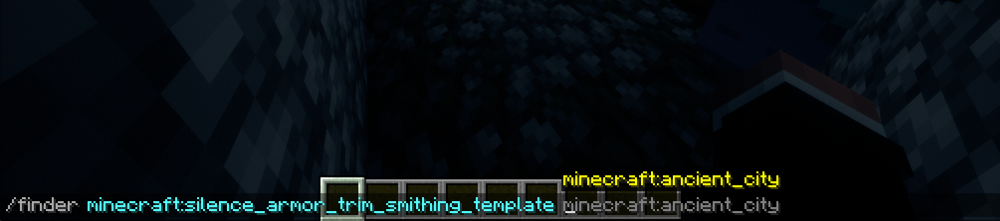
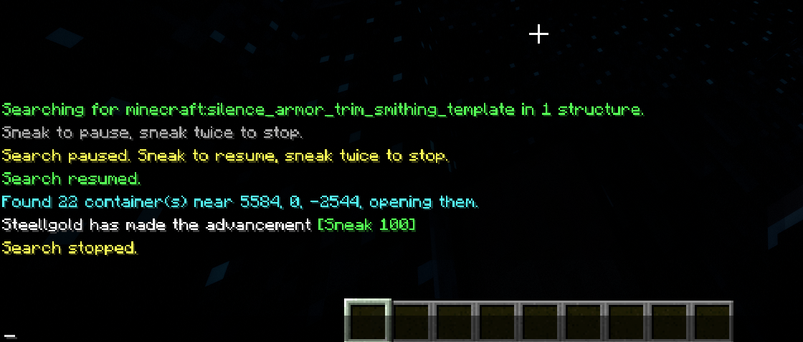

<p align="center">
  
</p>

Client-side Fabric mod for Minecraft 26.1 and 26.2. Looks for an item in generated structures: locates one, teleports you there in spectator, switches to creative to open containers, repeats until it finds it. Locate, teleport and gamemode go through the integrated server, not chat commands.

## Commands

```
/find <item>
/find <item> <structure>
/find pause
/find resume
/find stop
```

`/finder` is an alias.

<p align="center">
  
</p>

<p align="center"><sub>Tab complete: items that drop in structure loot, then the matching structures.</sub></p>

<p align="center">
  
</p>

<p align="center"><sub>Search starts, you sneak to pause or resume, sneak twice to stop.</sub></p>

Tab complete works. Structure suggestions are filtered by loot table in singleplayer only (loot tables aren't sent to clients). In multiplayer you get the full list.

Sneak once to pause/resume, sneak twice quickly to stop. Pause stays in spectator so you don't suffocate in a wall. Stop puts you back in whatever gamemode you had.

## Requirements

Minecraft 26.1 or 26.2, Fabric Loader 0.19.3+, Fabric API, Java 25.

Needs cheats (gamemaster / level 2). Works in singleplayer or when you host the LAN world — it talks to the integrated server directly, so `/locate` and `/tp` never show up in chat. Does not work as a client on someone else's server.

## Build

```
./gradlew build
```

Jar ends up in `build/libs/`.

## License

MIT
